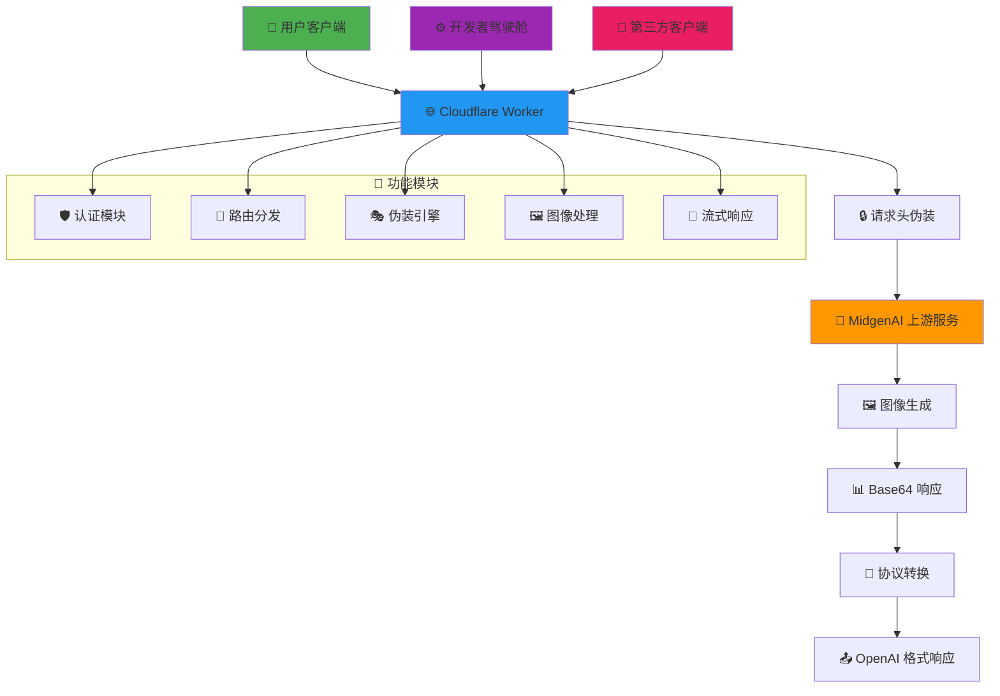
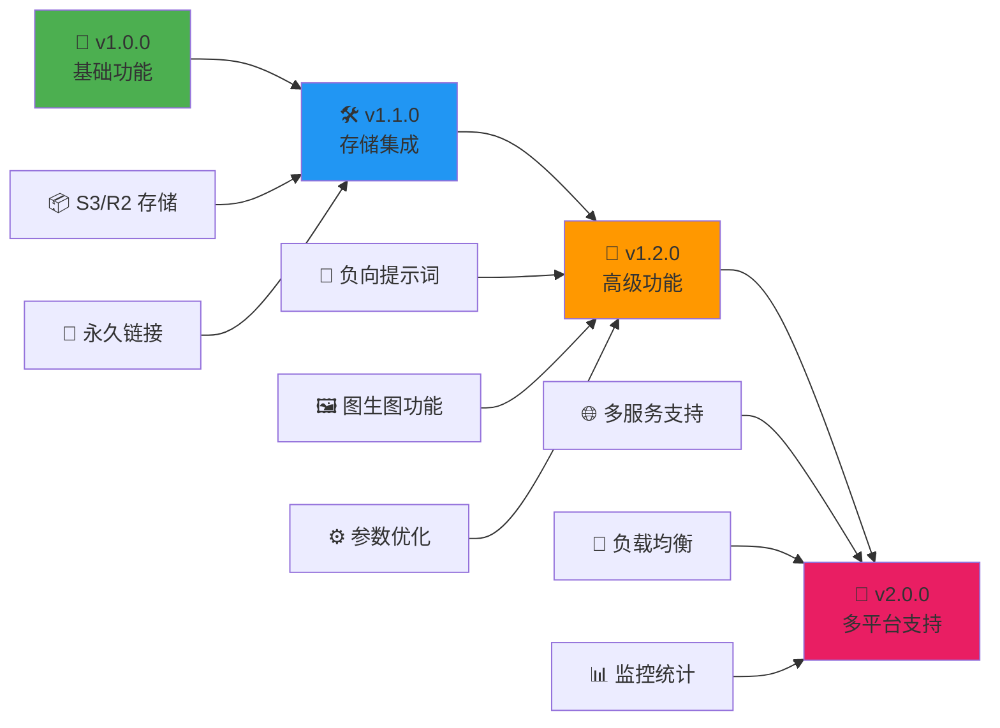

# 🎨 MidgenAI-2API (Cloudflare Worker 版)

[](https://opensource.org/licenses/Apache-2.0)
[](https://workers.cloudflare.com/)
[]()
[]()

> **"让每一次灵感的迸发，都不被繁琐的技术壁垒所阻挡。"**
>
> *MidgenAI-2API 是一个极简主义的艺术品。它不需要服务器，不需要 Docker，不需要复杂的配置。它只是一个单纯的 JavaScript 文件，却能撬动强大的 AI 绘图能力。*

---

## 📖 目录

- [✨ 项目简介](#-项目简介)
- [🚀 核心特性](#-核心特性)
- [⚡ 一键部署](#-一键部署)
- [🎮 使用指南](#-使用指南)
- [🏗️ 系统架构](#️-系统架构)
- [🔧 技术实现](#-技术实现)
- [📁 项目结构](#-项目结构)
- [🗺️ 未来规划](#️-未来规划)
- [🤖 AI 备忘录](#-ai-备忘录)
- [📜 开源协议](#-开源协议)

---

## ✨ 项目简介

在当今的 AI 浪潮中，许多强大的工具被封装在复杂的网页交互之下。**MidgenAI-2API** 的诞生，旨在打破这种"网页孤岛"。

我们利用 **Cloudflare Workers** 的边缘计算能力，将 `midgenai.com` 的图像生成服务，无损、匿名地转换为标准的 **OpenAI 格式 API**。

这不仅仅是一个代理工具，它是一次**去中心化**与**Serverless（无服务器）**架构的实践。它告诉我们：**只要有想象力，每个人都可以构建属于自己的 AI 基础设施。**

---

## 🚀 核心特性

### 🌟 核心优势

| 特性 | 说明 | 优势 |
| :--- | :--- | :--- |
| **☁️ 无服务器架构** | 基于 Cloudflare Workers | **零成本**，无需购买服务器，毫秒级启动 |
| **🎭 完全匿名** | 无需 Cookie，自动伪装 | **开箱即用**，保护用户隐私 |
| **🔌 OpenAI 全兼容** | 支持 `/v1/chat` 和 `/v1/images` | **无缝集成**现有 AI 生态 |
| **🌊 伪流式响应** | Pseudo-Streaming 技术 | 实时反馈体验 |
| **🎛️ 开发者驾驶舱** | 内置 Web UI | 可视化调试和预览 |

### ⚖️ 优缺点分析

**✅ 优点**
- 部署极快（<1分钟）
- 免费（利用 CF 免费额度）
- 代码透明，无需维护
- 支持多种客户端

**❌ 缺点**
- 依赖上游服务稳定性
- 暂不支持复杂负向提示词

---

## ⚡ 一键部署

> **小白友好提示**：你不需要懂代码，只需要会"复制粘贴"。

### 方法 A：手动部署（推荐）

1. **注册 Cloudflare**
   - 访问 [dash.cloudflare.com](https://dash.cloudflare.com/)
   - 创建免费账户

2. **创建 Worker**
   ```bash
   # 在 Cloudflare 控制台：
   # 1. 点击 "Workers & Pages"
   # 2. 点击 "Create Application" 
   # 3. 点击 "Create Worker"
   ```

3. **部署代码**
   ```bash
   # 4. 删除默认代码
   # 5. 复制 worker.js 所有内容
   # 6. 粘贴到编辑器
   # 7. 点击 "Deploy"
   ```

4. **完成部署**
   ```bash
   # 🎉 恭喜！你的 API 已就绪
   # 访问: https://你的worker.你的子域.workers.dev
   ```

### 方法 B：增强安全（可选）

```bash
# 在 Worker 设置中添加环境变量：
变量名: API_MASTER_KEY
变量值: sk-你的自定义密码
```

---

## 🎮 使用指南

### 1. 🖥️ 开发者驾驶舱

部署完成后，访问你的 Worker 域名：

```bash
https://你的worker.你的子域.workers.dev
```

你将看到：
- 🎨 赛博朋克风格控制台
- ⚙️ 参数调节面板
- 👀 实时预览窗口
- 📥 一键下载功能

### 2. 🔌 API 接入

**NextChat / LobeChat 配置：**
```yaml
接口地址: https://你的worker.你的子域.workers.dev/v1
API Key: 1 (或你设置的自定义密钥)
模型名称: midgen-v1
```

**cURL 测试：**
```bash
curl https://你的worker域名/v1/chat/completions \
  -H "Content-Type: application/json" \
  -H "Authorization: Bearer 1" \
  -d '{
    "model": "midgen-v1",
    "messages": [{"role": "user", "content": "一只赛博朋克风格的猫"}],
    "stream": true
  }'
```

**直接图像生成：**
```bash
curl https://你的worker域名/v1/images/generations \
  -H "Content-Type: application/json" \
  -H "Authorization: Bearer 1" \
  -d '{
    "model": "midgen-v1",
    "prompt": "星空下的独角兽",
    "size": "1024x1024"
  }'
```

---

## 🏗️ 系统架构



### 🔄 数据流说明

1. **请求入口**：用户通过 Web UI 或 API 发送请求
2. **认证鉴权**：验证 API Key 和请求权限
3. **协议转换**：将 OpenAI 格式转换为 MidgenAI 格式
4. **请求伪装**：添加必要的 HTTP 头部伪装浏览器
5. **上游调用**：调用 MidgenAI 图像生成服务
6. **响应处理**：将 Base64 图像转换为 OpenAI 兼容格式
7. **结果返回**：通过流式或非流式方式返回结果

---

## 🔧 技术实现

### 🎭 核心伪装机制

```javascript
// 关键伪装头部
const SPOOF_HEADERS = {
  "Origin": "https://www.midgenai.com",
  "Referer": "https://www.midgenai.com/text-to-image", 
  "User-Agent": "Mozilla/5.0 (Windows NT 10.0; Win64; x64) AppleWebKit/537.36",
  "Accept": "*/*",
  "Accept-Language": "zh-CN,zh;q=0.9,en;q=0.8"
};
```

**工作原理**：
- 🕵️ 模拟浏览器请求头
- 🔄 绕过服务端检测
- 🎯 实现完全匿名访问

### 🌊 伪流式响应技术

```javascript
// 使用 TransformStream 实现流式体验
const { readable, writable } = new TransformStream();
const writer = writable.getWriter();

// 模拟实时生成过程
await writer.write(encoder.encode("data: 正在生成图像...\n\n"));
await writer.write(encoder.encode("data: 图像生成完成\n\n"));
await writer.write(encoder.encode('data: [DONE]\n\n'));
```

**优势**：
- ⚡ 提升用户体验
- 🔄 兼容标准 SSE 协议
- 🎨 支持实时状态更新

### 🎨 Web Components 前端

```javascript
// 使用原生 Web Components
class DeveloperCockpit extends HTMLElement {
  constructor() {
    super();
    this.attachShadow({ mode: 'open' });
    // 零依赖，极致轻量
  }
}
```

**特点**：
- 📦 无外部依赖
- 🎯 样式隔离（Shadow DOM）
- ⚡ 极致性能

---

## 📁 项目结构

```text
midgenai-2api-cfwork/
├── 📄 worker.js              # 🎯 核心单文件：包含所有逻辑
│   ├── ⚙️ CONFIG 对象         # 项目配置和常量
│   ├── 🚀 Worker 入口         # 请求路由和分发  
│   ├── 🔌 API 代理逻辑        # OpenAI 协议适配
│   ├── 🎭 上游请求伪装        # 浏览器头模拟
│   ├── 🖼️ 图像生成处理        # Base64 图像处理
│   └── 🖥️ 开发者驾驶舱 UI     # 内置 Web 界面
├── 📖 README.md              # 📚 项目文档
└── 📜 LICENSE                # ⚖️ Apache 2.0 协议
```

**架构特点**：
- 🎯 **单文件设计**：所有功能集成在一个文件中
- 🏗️ **模块化组织**：清晰的代码结构
- 🔧 **配置即代码**：所有配置通过 JavaScript 对象管理
- 🎨 **前后端一体**：API 和 UI 完美融合

---

## 🗺️ 未来规划

### 🚧 当前局限

- **并发限制**：Cloudflare 免费版每日 10 万次请求限制
- **图片存储**：Base64 直接返回，不持久化存储
- **功能限制**：暂不支持复杂负向提示词

### 🎯 开发路线图



**版本规划**：
- **v1.1.0**：集成 Cloudflare R2 存储，提供永久图片链接
- **v1.2.0**：支持负向提示词和图生图功能
- **v2.0.0**：多服务支持和企业级特性

---

## 🤖 AI 备忘录

> 为 AI 助手和开发者提供的技术元数据

### 🔧 技术栈信息

```yaml
项目名称: "midgenai-2api"
运行时: "Cloudflare Workers"
语言: "JavaScript (ES6+)"
依赖: "零依赖 (Zero Dependency)"
模式: "API Gateway / 协议转换"
认证: "Bearer Token 自定义实现"
```

### 🎯 核心模式

- **🔀 反向代理**：透明转发上游请求
- **🎭 协议适配**：OpenAI → MidgenAI 格式转换
- **🛡️ 中间件**：请求头伪装和响应处理
- **🌊 流式处理**：TransformStream 实时响应

### 📚 发现方法

```bash
# 通过浏览器开发者工具分析
1. 打开浏览器开发者工具 (F12)
2. 切换到 Network 标签页
3. 在 MidgenAI 官网执行图像生成
4. 找到 API 请求，右键 "Copy as cURL"
5. 分析请求头和响应格式
```

---

## 📜 开源协议

本项目采用 **Apache License 2.0** 协议开源。

**这意味着你可以：**
- ✅ 自由使用、修改、分发代码
- ✅ 用于商业项目
- ✅ 集成到私有项目

**需要遵守：**
- 📝 保留原作者的版权声明
- 📄 在修改文件中添加变更说明
- 🤝 秉持开源精神，回馈社区

> **"代码是冰冷的逻辑，但开源赋予了它温度。"**
>
> *如果你觉得这个项目对你有帮助，请点亮右上角的 Star ⭐，这是对开发者最大的鼓励！*

---

**项目地址**: [https://github.com/lza6/midgenai-2api-cfwork](https://github.com/lza6/midgenai-2api-cfwork)

**问题反馈**: 欢迎提交 Issue 和 Pull Request！

---
*最后更新: 2025年11月23日*
